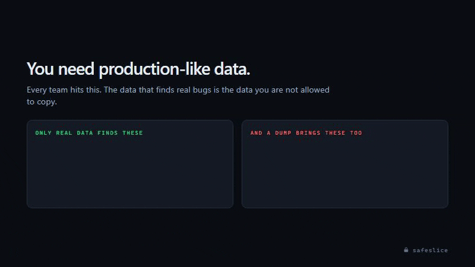

<div align="center">
hi


### Create production-like PostgreSQL development databases — without copying production PII

[](https://github.com/Autometiq/safeslice/actions/workflows/ci.yml)
[](go.mod)
[](#development)
[](LICENSE)
[](https://goreportcard.com/report/github.com/Autometiq/safeslice)

[Install](#install) · [How it works](#how-it-works) · [Masking](#masking) · [Security](#security-model) · [CLI](#advanced-cli--cicd) · [Contributing](#contributing)

<br />



</div>

<br />

## The problem

You need realistic data to find real bugs — the null that only exists in row 4,000,000, the customer with 900 orders who breaks the query, the encoding no seed script invents.

You cannot put production data on a laptop. A `pg_dump` does not know which columns are people, so it copies **all** of them onto unmanaged laptops, into CI logs, into local backups. And it does not fit anyway.

**Safeslice takes a slice, not a copy.** A few thousand rows instead of 480 GB, with every name, email, phone and card number replaced on the way out, every foreign key still intact, and a privacy scan over the result.

<br />

## Install

**macOS / Linux** — detects your platform:

```bash
curl -sSfL "https://github.com/Autometiq/safeslice/releases/latest/download/safeslice_$(uname -s | tr A-Z a-z)_$(uname -m | sed 's/x86_64/amd64/;s/aarch64/arm64/').tar.gz" | tar xz
sudo mv safeslice /usr/local/bin/
```

**Windows** — PowerShell:

```powershell
Invoke-WebRequest https://github.com/Autometiq/safeslice/releases/latest/download/safeslice_windows_amd64.zip -OutFile safeslice.zip
Expand-Archive safeslice.zip -DestinationPath $env:LOCALAPPDATA\Programs\safeslice -Force
$env:PATH += ";$env:LOCALAPPDATA\Programs\safeslice"
```

**Go toolchain** — any platform:

```bash
go install github.com/Autometiq/safeslice/cmd/safeslice@latest
```

Then check it:

```bash
safeslice --version
```

<details>
<summary>Docker, Linux packages, and verifying your download</summary>

<br />

```bash
docker run --rm ghcr.io/autometiq/safeslice:latest --help
```

```bash
sudo dpkg -i safeslice_amd64.deb   # Debian / Ubuntu
sudo rpm  -i safeslice_amd64.rpm   # RHEL / Fedora / SUSE
sudo apk add --allow-untrusted safeslice_amd64.apk   # Alpine
```

Every release ships a `checksums.txt`. If you are putting this on a machine that touches production, verify what you downloaded:

```bash
curl -sSfLO https://github.com/Autometiq/safeslice/releases/latest/download/checksums.txt
sha256sum -c checksums.txt --ignore-missing
```

Builds are produced by [goreleaser](.goreleaser.yaml) in GitHub Actions from a tagged commit — Linux, macOS and Windows on amd64 and arm64 — so the binary you download corresponds to source you can read.

One static file. No runtime, no server, no control plane. `CGO_ENABLED=0` including the SQLite key store, so there is no libc dependency either.

</details>

<br />

## Use it

```bash
safeslice
```

That is the whole workflow. The wizard connects to your source, reads the schema, asks about the columns it cannot judge, shows you exactly what the slice contains **before anything moves**, loads it, verifies the result and writes the report.

```
  What would you like to do?

❯ 1  Create a safe development database   the whole workflow, start to finish
  2  Inspect an existing configuration    what a run would do; reads no data
  3  Verify an existing database          scan for personal data that survived
  4  Run demo                             throwaway database — nothing of yours is touched
  5  Advanced / CLI mode                  the commands behind all of this
  6  Quit
```

No database of your own yet? Pick **Run demo** — it starts a throwaway PostgreSQL in Docker, seeds it with realistic fake customers, and runs the entire pipeline against it.

<br />

## What a run looks like

Real output, abbreviated:

```
== Database discovered ==

  Tables                    7
  Relationships             6
  Sensitive columns found   9
  Classified automatically  5
  Need your decision        4

  comments.body                      redact   free text
  companies.slug                     secret   unique, cannot be emptied
  order_items.sku                    redact   unbounded text

== Slice preview ==

  TABLE                 ROWS
  public.companies      3
  public.events         12
  public.users  (root)  12

  Total                 27

  ✓ Foreign-key closure complete — every row brings its parents
  ⚠ 1 relationship the database does not enforce, so it was not followed:
    comments.commentable_id (polymorphic, with commentable_type) — no foreign key

╭──────────────────────────────────────────────────────╮
│                  SAFESLICE REVIEW                    │
├──────────────────────────────────────────────────────┤
│ Source         shop   localhost:5432                 │
│ Target         shop_dev                              │
│ Rows           27                                    │
│ Masked         6 columns                             │
│ Redacted       3 columns                             │
│                                                      │
│ ✓ Source is read-only — it will not be modified      │
│ ✓ Foreign-key integrity preserved                    │
│ ✓ Free text reviewed                                 │
╰──────────────────────────────────────────────────────╯

❯ 1  Create the database   start reading and loading
  2  Change masking
  ...
```

Nothing is read from your tables and nothing is written to the target until you choose **Create the database**.

<br />

## How it works

| | |
|---|---|
| **1. Discover** | Reads `pg_catalog` for tables, columns, primary keys, unique constraints, identity and generated columns, sequences and partitions. No table data. |
| **2. Slice** | Walks the foreign-key graph from a root table. Parents are followed transitively, children to a bounded depth, so the result is referentially complete but not the whole database. |
| **3. Mask** | Replaces personal data in transit, deterministically, before it ever reaches disk. |
| **4. Load** | Streams into the target in dependency order inside one transaction, handling cycles, identity columns, generated columns, sequences and triggers. |
| **5. Verify** | Scans the loaded database for values that still look like real personal data, and writes the report. |

The whole read side runs inside one `REPEATABLE READ` snapshot, so a parent row cannot vanish between the query that found a child and the query that fetches the parent.

<br />

## Masking

Deterministic by design: the same input and seed always produce the same replacement, so `users.email` and `invoices.billing_email` still join after masking. These are real outputs at seed `safeslice`:

| Column | Before | After |
|---|---|---|
| `users.email` | `john@example.com` | `user_0b1343bf051a1e1c@example.invalid` |
| `users.first_name` | `John` | `Riley` |
| `users.last_name` | `Smith` | `Kowalski` |
| `users.phone` | `+1 555 010 2938` | `+15550563127` |
| `payments.card_number` | `4111111111111111` | `00D1AF1CBD6` |
| `users.password` | `hunter2` | `REDACTED` |
| `tickets.body` | `Called about a refund…` | *dropped* |

Rules: `email` `phone` `name` `first_name` `last_name` `address` `govid` `ip` `secret` `redact` `keep`.

Key columns are never masked — rewriting them would destroy the referential integrity the slice exists to preserve. Values are constraint-aware: `NOT NULL` is respected, `varchar(n)` is not overflowed, an `int` column never receives a string, and a column under a `UNIQUE` index is retried until the generated value is free.

**Free text is the honest limit.** No regex reliably scrubs a support ticket that happens to quote a customer's address. Safeslice does not pretend otherwise: it surfaces every unclassified text column and asks, and `strict` mode (on by default) refuses to run while any remain unreviewed.

<br />

## What you get

```
safeslice-output/
├── README.md            what ran, what was masked, how to connect
├── report.html          offline report — no CDN, no scripts, opens from disk
├── summary.json         machine-readable result for CI
├── tables.csv           per-table metadata (never row data)
└── masking-rules.yaml   the rules applied, ready to commit
```

Plus a `safeslice.yaml` in your project, so the same slice is repeatable by anyone on the team and by CI. No artifact ever contains a password — a test walks every generated file to prove it.

<br />

## Security model

- **The source is opened read-only.** `SET default_transaction_read_only = on` before anything else runs, so no bug here and no predicate you paste can write to production. Run it against a replica.
- **It refuses to run** when the target resolves to the same host, port and database as the source.
- **Destructive target operations require typing the database name.** Nothing is silently overwritten.
- **Credentials are never printed or stored.** Connection strings are reduced to host/port/database/user before reaching any log, report or saved profile.
- **Verification is a safety check, not a proof.** A clean scan means no known pattern of personal data was detected in the sampled rows. It is not a mathematical guarantee that arbitrary free text contains none, and Safeslice never claims it is.

Report a vulnerability: [SECURITY.md](SECURITY.md).

<br />

## Configuration

`safeslice.yaml` is written for you and meant to be committed:

```yaml
version: 1
source:
  schemas: [public]

slice:
  root: users
  where: "created_at > '2026-01-01'"   # optional
  limit: 1000
  child_depth: 1

mask:
  seed: safeslice        # share it, and everyone's snapshots agree
  strict: true           # unreviewed text columns stop the run
  rules:
    users.email: email
    users.password: secret
    tickets.body: redact

# Relationships PostgreSQL does not enforce — Rails polymorphic associations,
# Django generic relations. Safeslice cannot see them without being told.
virtual_keys:
  - table: comments
    columns: [commentable_id]
    references: { table: posts, columns: [id] }
    when: "commentable_type = 'Post'"
```

<br />

## Advanced CLI / CI-CD

The wizard is for humans. These are for scripts:

| Command | Purpose |
|---|---|
| `safeslice init` | Read the schema, generate a reviewable `safeslice.yaml` |
| `safeslice plan` | Show what a run would do — reads no table data |
| `safeslice run` | Extract, mask in transit, load into a target or write SQL |
| `safeslice verify` | Audit a database for surviving personal data; non-zero exit on findings |
| `safeslice report` | Show and open the last run's report |
| `safeslice demo` | Start or stop the throwaway demo database |

```bash
safeslice run --config safeslice.yaml --to "$DATABASE_URL"
safeslice verify --target "$DATABASE_URL"
```

`verify` exits non-zero when it finds anything, so it gates a pipeline as-is.

<br />

## Architecture

```
cmd/safeslice        cobra wiring and the interactive wizard
internal/catalog     pg_catalog introspection
internal/graph       FK graph, topological order, cycle detection
internal/keyset      SQLite-backed key closure, spilled to disk
internal/extract     COPY streaming inside one consistent snapshot
internal/mask        deterministic transformers
internal/load        cycle plans, identity/generated columns, sequences
internal/verify      PII scanner
internal/report      README, HTML, JSON, CSV, rules artifacts
```

The key closure lives in a local SQLite file rather than a temp table on the source, which is what lets Safeslice run against a read replica with no write permission anywhere.

<br />

## Contributing

```bash
git clone https://github.com/Autometiq/safeslice
cd safeslice
go build ./...
go test ./...                                    # unit tests
SAFESLICE_TEST_DSN="postgres://…" go test ./...  # + integration and e2e
```

The end-to-end suite proves the two properties that matter: **zero foreign-key orphans** after a load, and **zero planted canaries** surviving masking. Both run in CI against PostgreSQL 13 and 17.

Issues and pull requests welcome — see [CONTRIBUTING.md](CONTRIBUTING.md) and [CODE_OF_CONDUCT.md](CODE_OF_CONDUCT.md).

<br />

## License

Apache-2.0. See [LICENSE](LICENSE) and [NOTICE](NOTICE).

<div align="center">
<br />
Built by <a href="https://autometiq.com">Autometiq</a> · Not affiliated with the PostgreSQL Global Development Group
</div>
