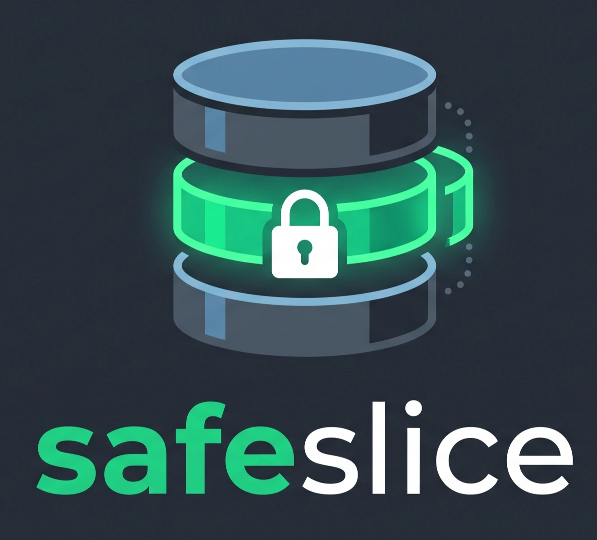

<div align="center">



<br />

### 🔒 Shrink & mask production Postgres — in a single command

<br />

[](https://github.com/Autometiq/safeslice/actions/workflows/ci.yml)
[](go.mod)
[](#development)
[](LICENSE)
[](https://goreportcard.com/report/github.com/Autometiq/safeslice)

<br />

[Installation](#-installation) · [Quickstart](#-quickstart) · [Commands](#-commands) · [Configuration](#-configuration-reference) · [Contributing](#-development)

</div>

<br />

<div align="center">

```bash
safeslice run --from "$PROD_URL" --table users --where "id = 4821" --to "$LOCAL_URL"
```

**One static Go binary. No runtime, no server, no Kubernetes, no control plane.**

</div>

<br />

## 🧠 Why safeslice exists

**Every engineering team hits the same wall.** You need realistic data locally to reproduce a bug or test a pipeline. You cannot legally put production data on a laptop, and you physically cannot fit 500 GB on one either. So the team writes seed scripts that generate fake companies linked to fake users — and those scripts never survive contact with real edge cases. Code that passes on 10 synthetic rows breaks on the nulls, the encodings, and the volume of production.

**The two tools that solved this are gone.** [Snaplet](https://supabase.com/blog/snaplet-is-now-open-source) shut down in August 2024. [Neosync](https://github.com/nucleuscloud/neosync) was archived in August 2025 after an acquisition — the hosted service is offline and the issue tracker is read-only. Neither died from lack of users. Both were open-source loss-leaders for a SaaS, and Neosync in particular was an orchestration platform built on Temporal, which is precisely why it needed revenue to exist. Teams that adopted either are now carrying an unmaintained dependency in their compliance path.

**A static binary cannot be shut down.** safeslice has no hosted service, no scheduler, and no database of its own. It reads one Postgres and writes another. It runs on a laptop, in CI, or on a bastion host, and it has no operating costs to fund. That is a deliberate architectural constraint, not an accident of scope — and it is why it will still work in five years.

<br />

## 📦 Installation

Download the binary for your platform from [**Releases**](https://github.com/Autometiq/safeslice/releases) — one file, nothing else required. No Go, no Python, no libc dependency. Linux, macOS and Windows, on amd64 and arm64.

**Linux / macOS**

```bash
curl -sSfL https://github.com/Autometiq/safeslice/releases/latest/download/safeslice_linux_amd64.tar.gz | tar xz
sudo mv safeslice /usr/local/bin/
```

**Windows (PowerShell)**

```powershell
Invoke-WebRequest -Uri "https://github.com/Autometiq/safeslice/releases/latest/download/safeslice_windows_amd64.zip" -OutFile safeslice.zip
Expand-Archive safeslice.zip -DestinationPath .
# then move safeslice.exe somewhere on your PATH
```

<details>
<summary>🔽 Other methods</summary>

```bash
# Go toolchain (any OS)
go install github.com/Autometiq/safeslice/cmd/safeslice@latest

# Docker
docker run --rm ghcr.io/autometiq/safeslice:latest --help

# Debian / Ubuntu
sudo dpkg -i safeslice_amd64.deb

# RHEL / Fedora
sudo rpm -i safeslice_amd64.rpm

# Alpine
sudo apk add --allow-untrusted safeslice_amd64.apk
```

On Windows, `go install` places the binary in `$env:USERPROFILE\go\bin`.

</details>

<br />

## 🚀 Quickstart

**The short version.** Run it with no arguments and answer the questions:

```bash
safeslice
```

The wizard connects to your source, reads the schema, asks about the columns it
cannot judge, shows you exactly what the slice contains **before** anything
moves, loads it, verifies the result, and writes the report. It ends with a
connection string you can paste into your app.

Everything below is the same workflow as individual commands, which is what CI
and scripts should use.

<br />

**1. Generate a config from your live schema.**

```bash
safeslice init --from "$PROD_URL"
```

This introspects your database and writes `safeslice.yaml` with every likely personal-data column already classified — emails, phones, names, addresses, credentials, card and government IDs.

**2. Review the columns it could not judge.**

```yaml
mask:
  strict: true
  rules:
    # Detected from column names.
    users.email: email
    users.password: secret

    # Free-text columns safeslice could not judge. They are set to `keep`
    # so this config runs, but each one is a decision you still owe.
    support_tickets.body: keep   # REVIEW: does this hold personal data?
```

No name-based heuristic knows that `col_7` holds a passport number. safeslice tells you exactly which columns it is unsure about instead of guessing — and with `strict: true`, an unreviewed text column stops the run rather than leaking quietly.

Commit this file. That is the adoption mechanism: one engineer commits it, and every teammate and every CI job inherits the same rules.

**3. Pull the slice.**

```bash
safeslice run --from "$PROD_URL" --to "postgres://localhost/dev"
```

```
safeslice v0.1.0
Fast, referentially-intact database subsetting & masking
by Autometiq • https://autometiq.com

[INFO] source app@prod-replica:5432/main (read-only session)
[PLAN] walking the foreign-key graph
[SUCCESS] foreign-key closure complete

╭────────────────────────────────────────────────────────────╮
│  Tables processed:          14                             │
│  Rows extracted & masked:   48,210                         │
│  Columns masked:            37                             │
│  Execution time:            6.41s                          │
│  Loaded into:               dev@localhost:5432/dev         │
│                                                            │
│  Zero FK orphans   — foreign keys stayed enforced          │
│  37 columns masked — run `safeslice verify` to confirm     │
╰────────────────────────────────────────────────────────────╯
```

**Then prove it is clean.**

```bash
safeslice verify --target "postgres://localhost/dev"
```

Scans for live email addresses, phone numbers, IP addresses and Luhn-valid payment cards, and exits non-zero on any finding. Gate your CI on it, or hand the output to a compliance reviewer.

<br />

## ✅ What safeslice solves

The easy 80% of database subsetting is a weekend project. These are the cases that break everything else — each one verified by an end-to-end test against real PostgreSQL:

| | Feature | Detail |
|---|---|---|
| ✅ | **Non-`DEFERRABLE` FK cycles** | `SET CONSTRAINTS ALL DEFERRED` only affects constraints declared `DEFERRABLE`, and Rails and Django do not declare them. safeslice breaks the cycle by inserting the closing column as `NULL`, then restoring it once every row exists. |
| ✅ | **Polymorphic & virtual keys** | Rails `commentable_type`/`commentable_id` and Django generic relations have no foreign key. Declare them in YAML and they join the graph like any other edge. |
| ✅ | **Deterministic masking** | The same input always yields the same fake, so a customer email appearing in three tables masks identically and every join still works. |
| ✅ | **Zero-leak verification** | `verify` is a standalone auditor, not a self-report. Its output is redacted, so the leak report never becomes a second leak. |
| ✅ | **Transitive parent closure** | Every selected row drags its referenced rows along, recursively. Foreign keys stay enforced throughout the load. |
| ✅ | **Identity & generated columns** | `GENERATED ALWAYS AS IDENTITY` gets `OVERRIDING SYSTEM VALUE`. Stored columns are recomputed from *masked* values. |
| ✅ | **Sequence resync** | Without `setval`, the application's very first insert collides on the primary key. Every owned sequence is advanced past the slice. |
| ✅ | **Composite & non-primary keys** | Composite foreign keys keep column order. Keys pointing at `UNIQUE` rather than the PK resolve correctly. |
| ✅ | **Partitioned tables** | FK on a partitioned parent is duplicated on every partition; without normalising to the root, the load fails on a duplicate key. |
| ✅ | **Unique-constraint collisions** | Two distinct emails hashing to one fake would fail the load. Collisions are retried with a salt until the value is free. |
| ✅ | **Type fidelity** | A phone stored as `bigint` gets a numeric fake. A type that cannot be masked safely is a hard error, never a silent corruption. |
| ✅ | **Bounded memory** | The key closure spills to a local SQLite file instead of a Go map, so a 500 GB source does not become tens of GBs of RSS. |
| ✅ | **Production safety** | Source session is read-only inside `REPEATABLE READ`. Loading into the same database you are reading from is refused outright. |

<br />

## 📋 Configuration reference

<details>
<summary><code>safeslice.yaml</code></summary>

```yaml
version: 1

source:
  schemas: [public]

slice:
  root: users
  where: "created_at > now() - interval '30 days'"
  limit: 1000
  child_depth: 1

mask:
  seed: team-seed          # same seed, same fakes, across the whole team
  strict: true             # refuse to run on unreviewed text columns
  pii_tables: [users, invoices]
  rules:
    users.email: email
    users.password: secret
    companies.name: keep   # a company name is not personal data
    support_tickets.body: redact

# Relationships PostgreSQL does not enforce, and therefore cannot reveal.
virtual_keys:
  - table: comments
    columns: [commentable_id]
    references: {table: posts, columns: [id]}
    when: "commentable_type = 'Post'"
```

Rules: `keep` · `redact` · `secret` · `email` · `phone` · `govid` · `first_name` · `last_name` · `name` · `address` · `ip`

</details>

<br />

## 🛠 Commands

| Command | Purpose |
|---|---|
| `safeslice` | Guided wizard: source → decisions → review → load → verify → report |
| `safeslice init` | Introspect the schema and generate a reviewable starting config |
| `safeslice plan` | Show exactly what a run would do — reads no table data |
| `safeslice run` | Extract, mask in transit, load into a target or write SQL |
| `safeslice verify` | Audit a database for surviving personal data; non-zero exit on findings |
| `safeslice report` | Show and open the report from the last run |
| `safeslice profiles` | List saved wizard profiles, or past runs with `--history` |
| `safeslice connections` | List saved connections (never passwords) |
| `safeslice demo` | Start or stop a throwaway database to try the whole thing on |

The wizard writes `safeslice.yaml` as it goes, so anything you do interactively
is repeatable non-interactively:

```bash
safeslice run --config safeslice.yaml --to "$DATABASE_URL"
safeslice verify --target "$DATABASE_URL"
```

<br />

## 📌 Status and scope

**v0.1 — PostgreSQL 13 through 17**, tested against every version in CI.

Masking is name-based and cannot know what an opaque column holds. Review your config before pointing safeslice at a regulated database, and run `verify` afterwards. Masked data is pseudonymous, not anonymous: treat a slice as sensitive, just far less so than the original.

MySQL support will land when an issue asks for it. Servers, schedulers and control planes will not — that is the boundary that turned Neosync into a company that had to die.

<br />

## 🧪 Development

```bash
go test ./...
```

Catalog and end-to-end tests require a real PostgreSQL instance and **skip** without one, so a green run on its own does not mean much. Docker is the easiest way to get a throwaway one — it is needed only for the test suite, never to *use* safeslice:

```bash
docker run -d -e POSTGRES_PASSWORD=pw -p 55432:5432 postgres:17
SAFESLICE_TEST_DSN="postgres://postgres:pw@localhost:55432/postgres" go test ./...
```

The end-to-end suite builds a source database seeded with canary values, slices it into a second database, then asserts the only two things that matter: **zero foreign-key orphans**, and **zero canaries surviving**. Neither can be established by unit tests. A subsetting tool that passes its unit tests and fails these is worse than no tool, because it looks like it worked.

Contributions welcome — see [CONTRIBUTING.md](CONTRIBUTING.md). Found a masking bypass? Please report it privately via [SECURITY.md](SECURITY.md).

<br />

---

<div align="center">

## 🏢 Enterprise support & consulting

**safeslice is built and maintained by [Autometiq](https://autometiq.com/).**

</div>

The open-source CLI is complete and free under Apache 2.0, and always will be. Some data problems need more than a CLI.

Autometiq works with engineering and platform teams on:

| | |
|---|---|
| **Custom masking algorithms** | Format-preserving encryption, referentially-consistent synthetic generation, and domain-specific rules for healthcare, financial and regulated datasets that no name-based heuristic can classify. |
| **Complex data migrations** | Cross-database moves, schema evolution under load, legacy consolidation, and zero-downtime cutovers where a failed migration is not an option. |
| **CI/CD & platform integration** | Ephemeral per-branch databases, automated refresh pipelines, policy-as-code masking gates, and audit evidence your compliance team will actually accept. |
| **Compliance engineering** | GDPR, HIPAA and SOC 2 reviews of your development data pipeline, with the controls and documentation to back them up. |

<div align="center">

**[Talk to us → autometiq.com](https://autometiq.com/)**

</div>

---

<div align="center">

<sub>Copyright © 2026 <a href="https://autometiq.com/">Autometiq</a> · Licensed under <a href="LICENSE">Apache 2.0</a></sub>

</div>
