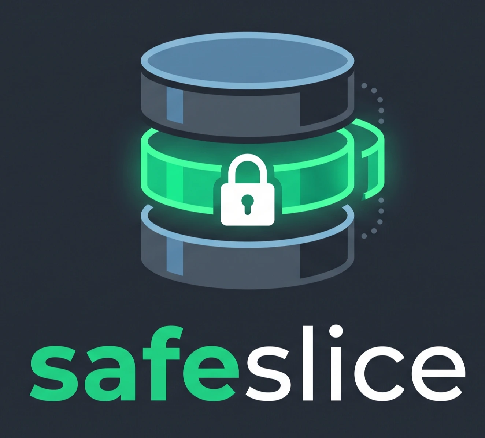
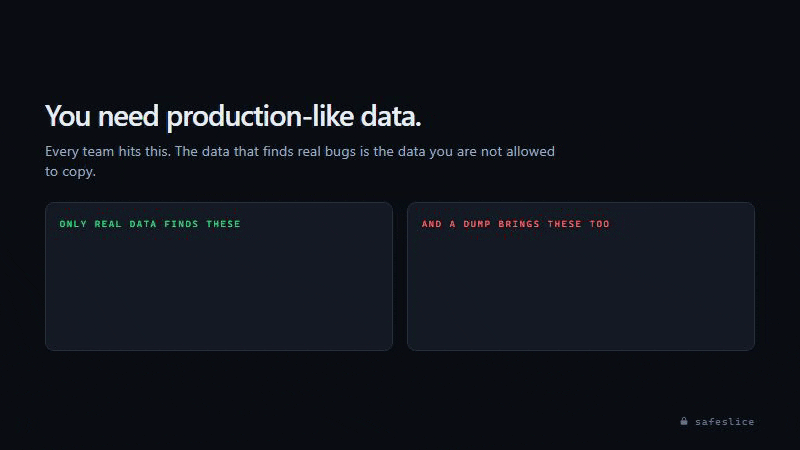

<div align="center">



### Enterprise-Grade PostgreSQL Database Subsetting & Data Pseudonymization

[](https://github.com/Autometiq/safeslice/actions/workflows/ci.yml)
[](go.mod)
[](#development)
[](LICENSE)

[Install](#install) · [Features](#enterprise-features) · [How it works](#how-it-works) · [Masking](#masking--data-privacy) · [Security](#security--compliance) · [CLI](#advanced-cli--cicd)

<br />



</div>

<br />

## Executive Summary

Safeslice bridges the gap between **compliance regulations (GDPR, HIPAA, SOC2)** and **engineering velocity**. It allows enterprise engineering teams to create referentially-intact, highly-realistic development environments from production data without risking a single byte of Personally Identifiable Information (PII).

Safeslice extracts a topological "slice" of your database, intelligently replacing sensitive data in-transit, and leaving you with a lightweight, secure replica that fits entirely on a developer's laptop.

---

## Enterprise Features

Safeslice is built for the complexity of modern production environments, where data is rarely perfectly structured.

- 🧩 **Referential Integrity Engine:** Navigates complex foreign-key graphs to extract a perfectly consistent slice without orphaned records.
- 🏗️ **Deep JSON/JSONB Masking:** Don't drop entire unstructured payloads just because they contain a single email. Safeslice recursively traverses complex JSON objects, applying deterministic masking only to targeted nested keys (e.g., `events.payload.user.contact.phone`) while preserving the rest of your data.
- 🔎 **Free-Text PII Scrubbing (`scrub_text`):** Automatically scan and replace embedded emails and phone numbers hiding inside large unstructured text blocks like support tickets, logs, and user comments, keeping the surrounding context perfectly readable for debugging.
- 🔒 **Zero-Trust Architecture:** Operates entirely client-side. Safeslice reads from a Read Replica and performs all masking in-transit inside memory. No intermediate files are created, and no production data touches disk until it is safely masked.
- ✅ **Post-Load Verification:** Built-in compliance auditing scans the final destination database to ensure no sensitive PII data managed to escape the masking rules, writing a permanent audit trail report.

<br />

## The Problem

You need realistic data to find real bugs — the null that only exists in row 4,000,000, the customer with 900 orders who breaks the query, the encoding no seed script invents. 

You cannot put production data on a laptop. A `pg_dump` does not know which columns are people, so it copies **all** of them onto unmanaged laptops, into CI logs, into local backups. And it does not fit anyway.

**Safeslice takes a slice, not a copy.** A few thousand rows instead of 480 GB, with every name, email, phone and card number replaced on the way out, every foreign key still intact, and a privacy scan over the result.

<br />

## Install

**macOS / Linux** — detects your platform:
```bash
curl -sSfL "https://github.com/Autometiq/safeslice/releases/latest/download/safeslice_$(uname -s | tr A-Z a-z)_$(uname -m | sed 's/x86_64/amd64/;s/aarch64/arm64/').tar.gz" | tar xz
sudo mv safeslice /usr/local/bin/
```

**Windows** — Command Prompt (cmd):
```cmd
curl -sSfL -o safeslice.zip https://github.com/Autometiq/safeslice/releases/latest/download/safeslice_windows_amd64.zip
tar -xf safeslice.zip
mkdir "%LOCALAPPDATA%\Programs\safeslice" 2>nul
move safeslice.exe "%LOCALAPPDATA%\Programs\safeslice\"
setx PATH "%PATH%;%LOCALAPPDATA%\Programs\safeslice"
```

<details>
<summary>Docker & Other Formats</summary>

```bash
docker run --rm ghcr.io/autometiq/safeslice:latest --help
```
Every release ships a `checksums.txt`. If you are putting this on a machine that touches production, verify what you downloaded:
```bash
curl -sSfLO https://github.com/Autometiq/safeslice/releases/latest/download/checksums.txt
sha256sum -c checksums.txt --ignore-missing
```
</details>

<br />

## Use it

```bash
safeslice
```

That is the whole workflow. The wizard connects to your source, reads the schema, asks about the columns it cannot judge, shows you exactly what the slice contains **before anything moves**, loads it, verifies the result and writes an audit report.

No database of your own yet? Pick **Run demo** — it starts a throwaway PostgreSQL container, seeds it with realistic fake customers, and runs the entire pipeline against it.

<br />

## Masking & Data Privacy

Safeslice's masking is **deterministic by design**: the same input and seed always produce the same replacement, ensuring cross-table joins remain perfectly intact across your distributed systems.

| Column | Before | After |
|---|---|---|
| `users.email` | `john@example.com` | `user_0b1343bf051a1e1c@example.invalid` |
| `users.first_name` | `John` | `Riley` |
| `users.phone` | `+1 555 010 2938` | `+15550563127` |
| `metadata` (JSON) | `{"email":"x@y.com", "plan":"pro"}`| `{"email":"user_abc@example.invalid", "plan":"pro"}`|
| `tickets.body` | `User jane@work.com called.` | `User user_xyz@example.invalid called.` |

### Configuration (`safeslice.yaml`)

Configuration is declarative and meant to be version controlled in your repository:

```yaml
version: 1
source:
  schemas: [public]

slice:
  root: users
  where: "created_at > '2026-01-01'"
  limit: 1000
  child_depth: 1

mask:
  seed: safeslice        # Share it, and everyone's snapshots agree
  strict: true           # Unreviewed text columns stop the run
  rules:
    users.email: email
    users.password: secret
    tickets.body: scrub_text                     # Enterprise Text Scrubbing
    events.payload.user.contact.phone: phone     # Deep JSON Path Masking
```

<br />

## Security & Compliance

Safeslice is designed with enterprise security architectures in mind:

- **The source is opened read-only.** `SET default_transaction_read_only = on` before anything else runs. Safeslice cannot write to production.
- **Destructive target operations require typing the database name.** Nothing is silently overwritten.
- **Credentials are never printed or stored.** Connection strings are redacted in memory before reaching any log, report or saved profile.
- **Automated Verification:** Safeslice verifies its own output. After loading, it scans the target for surviving email addresses, phone numbers, IPs, and Luhn-valid card numbers, ensuring compliance standards are met.

<br />

## Advanced CLI / CI-CD

The interactive wizard is for developers. The CLI is for your pipelines.

| Command | Purpose |
|---|---|
| `safeslice init` | Read the schema, generate a reviewable `safeslice.yaml` |
| `safeslice plan` | Show what a run would do — reads no table data |
| `safeslice run` | Extract, mask in transit, load into a target or write SQL |
| `safeslice verify` | Audit a database for surviving personal data; non-zero exit on findings |

```bash
safeslice run --config safeslice.yaml --to "$DATABASE_URL"
safeslice verify --target "$DATABASE_URL"
```

`verify` exits non-zero when it finds anything, so it natively gates CI/CD pipelines.

<br />

## License

Apache-2.0. See [LICENSE](LICENSE) and [NOTICE](NOTICE).

<div align="center">
<br />
Built by <a href="https://autometiq.com">Autometiq</a> · Not affiliated with the PostgreSQL Global Development Group
</div>
